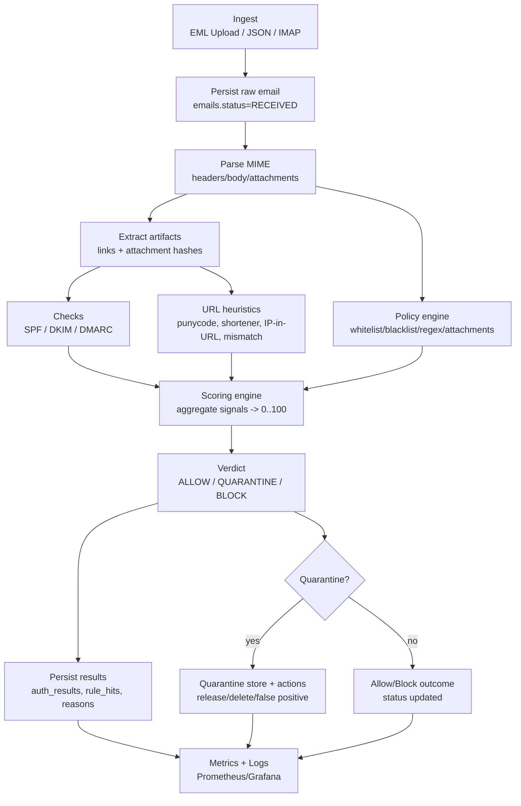

# Email Firewall

A rule-based email security system built with Spring Boot and React.

This project analyzes incoming emails, applies configurable security rules, calculates a threat score, and assigns a final verdict: **ALLOW**, **QUARANTINE**, or **BLOCK**.

---

## Tech Stack

### Backend
- Spring Boot 3
- Spring Data JPA
- PostgreSQL
- Flyway (database migrations)

### Frontend
- React
- REST API integration

### Optional
- Spring Boot Actuator
- Prometheus
- Grafana

---

## Core Features

### Email Ingestion

- `POST /api/ingest/json`
- Persists emails in the database
- Automatically evaluates rules
- Computes threat score and verdict

---

### Rule Engine

Configurable rules stored in the database.

#### Supported Rule Types
- BLACKLIST
- WHITELIST
- REGEX
- KEYWORD
- ATTACHMENT

#### Rule Actions
- ADD_SCORE
- SET_VERDICT
- BYPASS

---

### Scoring & Verdict

- Each email receives a cumulative threat score.
- Score thresholds determine:
    - ALLOW
    - QUARANTINE
    - BLOCK

---

### Authentication Signals

Stores and evaluates:
- SPF
- DKIM
- DMARC

---

### URL & Attachment Analysis

- URL extraction
- Attachment extension validation
- SHA-256 hashing

---

### Audit Logging

Tracks:
- Rule changes
- Email processing
- Quarantine actions

---

## Database Management

- Schema versioning is handled using Flyway migrations.

---

## Flowchart

