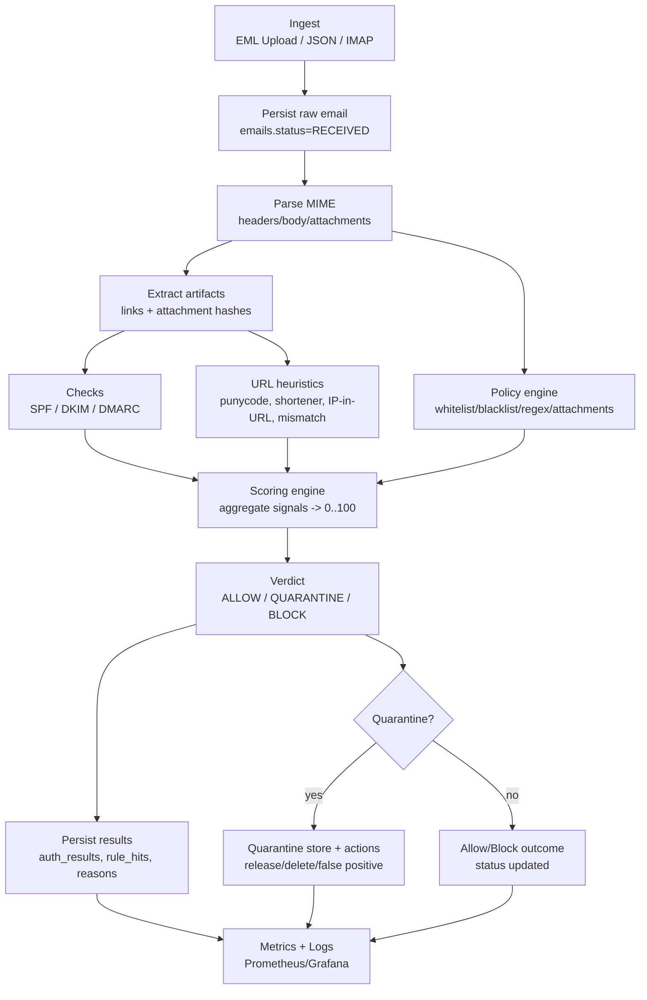

```mermaid

flowchart TD
A[Ingest<br/>EML Upload / JSON / IMAP] --> B[Persist raw email<br/>emails.status=RECEIVED]
B --> C[Parse MIME<br/>headers/body/attachments]
C --> D[Extract artifacts<br/>links + attachment hashes]
D --> E[Checks<br/>SPF / DKIM / DMARC]
D --> F[URL heuristics<br/>punycode, shortener, IP-in-URL, mismatch]
C --> G[Policy engine<br/>whitelist/blacklist/regex/attachments]
E --> H[Scoring engine<br/>aggregate signals -> 0..100]
F --> H
G --> H
H --> I[Verdict<br/>ALLOW / QUARANTINE / BLOCK]
I --> J[Persist results<br/>auth_results, rule_hits, reasons]
I --> K{Quarantine?}
K -- yes --> L[Quarantine store + actions<br/>release/delete/false positive]
K -- no --> M[Allow/Block outcome<br/>status updated]
J --> N[Metrics + Logs<br/>Prometheus/Grafana]
L --> N
M --> N

```